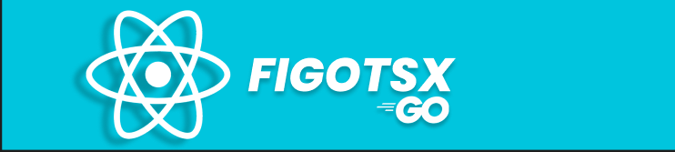

# FIGOTSX



## Descripcion

**_Figotsx es una plataforma de renderizado del lado del servidor_** (SSR) que combina tecnologías altamente eficientes y conocidas como Golang y React. Este proyecto fue desarrollado como resultado de investigaciones llevadas a cabo para la **_Universidad Corporativa del Meta_** (UNIMETA) con el objetivo de encontrar una nueva forma de estructurar y crear aplicaciones web más robustas.

**_Figotsx toma inspiración de Next.js_**, un popular framework de React para renderizado del lado del servidor, y adapta su funcionalidad a través de la **_combinación de Golang y React_**. Esta sinergia permite a los desarrolladores crear aplicaciones web más rápidas y eficientes, brindando una experiencia de usuario excepcional.

La arquitectura de Figotsx aprovecha las características únicas de Golang para el manejo de peticiones, enrutamiento y procesamiento del lado del servidor, mientras que React se encarga de la interfaz de usuario y la interactividad del cliente. Esta combinación ofrece una solución altamente escalable y robusta para proyectos de gran envergadura.

## Instalacion y Uso

Para poder usar Figotsx debes tener instalado npm y golang:

Antes de utilizar Figotsx, asegúrate de tener instalados npm y Golang en tu sistema.

Sigue los siguientes pasos para comenzar a trabajar con Figotsx:

1. **_Clona el Repositorio:_** Descarga el código fuente de Figotsx desde el repositorio oficial en GitHub.

2. **_Instala las Dependencias:_** Ejecuta el comando `npm install` para instalar todas las dependencias necesarias para el proyecto.

3. **_Configura las Variables de Entorno:_** Figotsx utiliza un archivo `.env` para almacenar variables de configuración. Asegúrate de crear este archivo y definir las variables de entorno necesarias para tu entorno de desarrollo.

4. **_Inicia el Servidor de Desarrollo:_** Para comenzar a programar con Figotsx, ejecuta el comando `npm run dev` en tu terminal. Esto iniciará el servidor de desarrollo y te permitirá ver los cambios en tiempo real a medida que trabajas en tu proyecto.

5. **_Construye la Aplicación:_** Una vez que hayas terminado de desarrollar tu aplicación, puedes generar la versión de producción ejecutando el comando `npm run build`. Esto creará un paquete optimizado y listo para implementar en un servidor de producción.

## Contribución

```markdown
Si deseas contribuir a este proyecto, sigue estos pasos:

1. Haz un fork del repositorio.
2. Crea una nueva rama: `git checkout -b mi-rama`
3. Realiza tus cambios y haz commit: `git commit -m "Descripción de los cambios"`
4. Haz push a la rama: `git push origin mi-rama`
5. Envía una solicitud de extracción.
```

## Licence

```markdown
MIT License

Copyright (c) 02/ago/2023 Duvan Rozo

Permission is hereby granted, free of charge, to any person obtaining a copy
of this software and associated documentation files (the "Software"), to deal
in the Software without restriction, including without limitation the rights
to use, copy, modify, merge, publish, distribute, sublicense, and/or sell
copies of the Software, and to permit persons to whom the Software is
furnished to do so, subject to the following conditions:

The above copyright notice and this permission notice shall be included in all
copies or substantial portions of the Software.

THE SOFTWARE IS PROVIDED "AS IS", WITHOUT WARRANTY OF ANY KIND, EXPRESS OR
IMPLIED, INCLUDING BUT NOT LIMITED TO THE WARRANTIES OF MERCHANTABILITY,
FITNESS FOR A PARTICULAR PURPOSE AND NONINFRINGEMENT. IN NO EVENT SHALL THE
AUTHORS OR COPYRIGHT HOLDERS BE LIABLE FOR ANY CLAIM, DAMAGES OR OTHER
LIABILITY, WHETHER IN AN ACTION OF CONTRACT, TORT OR OTHERWISE, ARISING FROM,
OUT OF OR IN CONNECTION WITH THE SOFTWARE OR THE USE OR OTHER DEALINGS IN THE
SOFTWARE.
```
